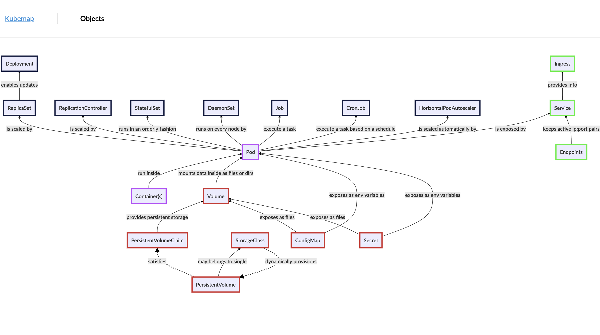

# Kubernetes Objects Map

This is a simple website with a map of Kubernetes objects. It shows connections and relationships between them. It was built with [Hugo](https://gohugo.io/) and [MermaidJS]( https://mermaidjs.github.io/).

Currently it is visible at [https://kubemap.netlify.com](https://kubemap.netlify.com).

