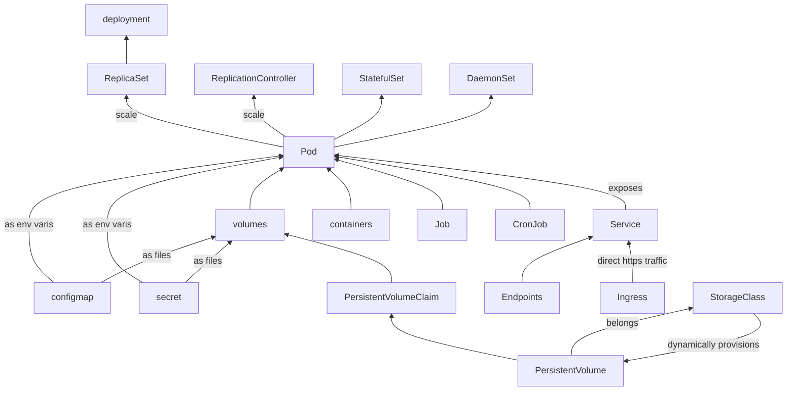

```mermaid
graph BT;
    configmap--as env varis-->pod
    configmap--as files-->volumes
    secret--as env varis-->pod
    secret--as files-->volumes
    volumes-->pod[Pod]
    containers-->pod
    pod--scale-->replicaset
    pod--scale-->ReplicationController
    replicaset[ReplicaSet]-->deployment
    job[Job]-->pod
    cronjob[CronJob]-->pod

    pod-->statefulset[StatefulSet]
    pod-->ds[DaemonSet]

    svc[Service]--exposes-->pod
    ep[Endpoints]-->svc
    ing[Ingress]--direct https traffic-->svc
    
    pv[PersistentVolume]-->pvc
    pvc[PersistentVolumeClaim]-->volumes
    sc[StorageClass]--dynamically provisions-->pv
    pv--belongs-->sc
```